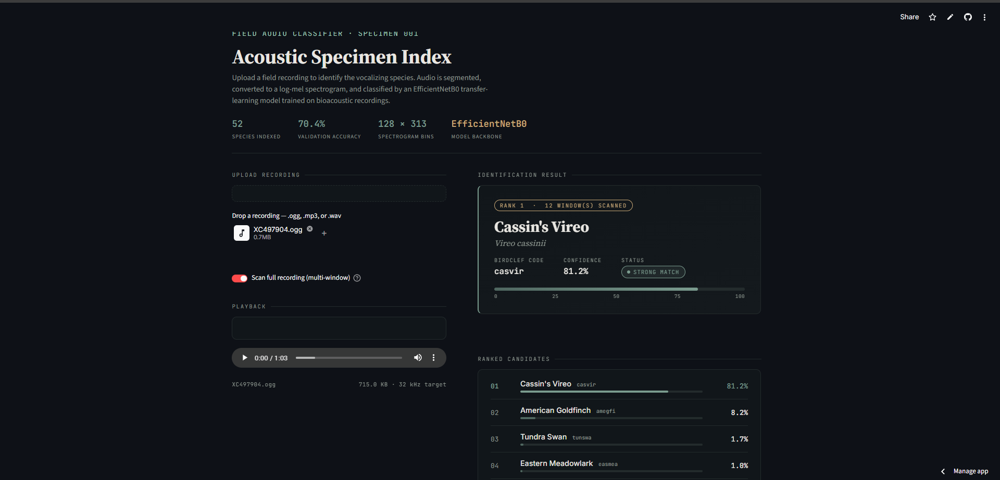

# 🪶 Acoustic Specimen Index

> **A deep learning bird species identification system that classifies bird vocalizations from field recordings using audio spectrograms and EfficientNetB0 transfer learning.**

[](https://python.org)
[](https://tensorflow.org)
[](https://streamlit.io)
[](https://arxiv.org/abs/1905.11946)
[](LICENSE)

---

## 📋 Table of Contents

- [Project Overview](#-project-overview)
- [Problem Statement](#-problem-statement)
- [Dataset Description](#-dataset-description)
- [Project Architecture](#-project-architecture)
- [Audio Preprocessing Pipeline](#-audio-preprocessing-pipeline)
- [Deep Learning Model Architecture](#-deep-learning-model-architecture)
- [Why EfficientNetB0](#-why-efficientnetb0)
- [Training Pipeline](#-training-pipeline)
- [Validation Strategy](#-validation-strategy)
- [Inference Pipeline](#-inference-pipeline)
- [Multi-Window Prediction Strategy](#-multi-window-prediction-strategy)
- [Streamlit Application Features](#-streamlit-application-features)
- [Results and Performance Metrics](#-results-and-performance-metrics)
- [Challenges Faced](#-challenges-faced)
- [Improvements Made During Development](#-improvements-made-during-development)
- [Future Enhancements](#-future-enhancements)
- [Installation Instructions](#-installation-instructions)
- [Usage Instructions](#-usage-instructions)
- [Project Structure](#-project-structure)
- [Technologies Used](#-technologies-used)
- [Author](#-author)

---

## 🔭 Project Overview

**Acoustic Specimen Index** is an end-to-end machine learning system for automated bird species identification from field audio recordings. The system accepts raw audio files (WAV, MP3, OGG) and returns a ranked list of predicted bird species with confidence scores and scientific names.

The system was built from the ground up — from raw audio data ingestion to a polished, dark-themed Streamlit web application. It underwent multiple design iterations, evolving from a custom CNN baseline through a series of preprocessing improvements to a fine-tuned EfficientNetB0 transfer-learning model.

**Key highlights at a glance:**

| Attribute | Value |
|---|---|
| Species indexed | 52 |
| Validation accuracy | **70.4%** |
| Model backbone | EfficientNetB0 (fine-tuned) |
| Spectrogram shape | 128 × 313 × 3 |
| Audio sample rate | 32 kHz |
| Silence gate | 45 dB |
| Inference mode | Single-segment & Multi-window |

---

## 🎯 Problem Statement

Bird species identification from audio recordings is an important task in ecological monitoring, biodiversity research, and citizen science. Traditionally this requires a trained ornithologist listening to recordings — a slow, expensive, and unscalable process.

The challenge is significant for several reasons:

- Bird vocalizations are **acoustically complex**: songs, calls, alarm signals, and mimicry overlap.
- Field recordings contain **environmental noise**: wind, rain, insects, and human activity.
- Many recordings are **long and sparsely vocalized** — the bird call may occupy only a few seconds of a multi-minute clip.
- Raw waveforms are not well-suited for image classifiers, requiring a domain-specific **audio-to-image transformation pipeline**.

This project automates species identification by converting audio to log-mel spectrograms and treating the classification task as an image recognition problem.

---

## 📦 Dataset Description

**Source:** [BirdCLEF (Kaggle)](https://www.kaggle.com/competitions/birdclef-2021)

The BirdCLEF dataset is a large-scale bioacoustics dataset consisting of short field recordings annotated with bird species labels. Recordings are stored as `.ogg` files organized into per-species folders.

| Dataset Property | Detail |
|---|---|
| Number of classes | 52 bird species |
| Final training samples | **~8,907** processed spectrogram files |
| File format (raw) | `.ogg` audio |
| File format (processed) | `.npy` (log-mel spectrograms) |
| Spectrogram resolution | 128 mel bins × 313 time frames |
| Target sample rate | 32,000 Hz |

> **Note on experiment history:** An earlier debugging experiment used a balanced subset of ~2,018 samples (~40 samples per species). That run was used for architecture exploration and iteration speed. The final production EfficientNetB0 model was trained on the full ~8,907 sample dataset.

**Species Coverage (sample):**

| Code | Common Name | Scientific Name |
|---|---|---|
| `acafly` | Acadian Flycatcher | *Empidonax virescens* |
| `amecro` | American Crow | *Corvus brachyrhynchos* |
| `easblu` | Eastern Bluebird | *Sialia sialis* |
| `daejun` | Dark-eyed Junco | *Junco hyemalis* |
| `veery` | Veery | *Catharus fuscescens* |
| `tuftit` | Tufted Titmouse | *Baeolophus bicolor* |
| ... | *(46 more species)* | ... |

---

## 🏗 Project Architecture

The system is organized into four logical layers:

```
┌─────────────────────────────────────────────────────────┐
│                  STREAMLIT APPLICATION                   │
│          (app.py — Upload, Display, Infer, Rank)         │
└─────────────────────┬───────────────────────────────────┘
                      │
┌─────────────────────▼───────────────────────────────────┐
│                  INFERENCE LAYER                         │
│   Single-Segment Pipeline  │  Multi-Window Pipeline      │
└─────────────────────┬───────────────────────────────────┘
                      │
┌─────────────────────▼───────────────────────────────────┐
│             AUDIO PREPROCESSING LAYER                    │
│  Load → Normalize → Silence Remove → Energy Window →    │
│  Mel Spectrogram → Log Scale → Min-Max Norm → 3ch Tensor│
└─────────────────────┬───────────────────────────────────┘
                      │
┌─────────────────────▼───────────────────────────────────┐
│              EFFICIENTNETB0 MODEL LAYER                  │
│  Pre-trained ImageNet backbone (fine-tuned) +            │
│  GlobalAveragePooling2D + Dense(256) + Dropout + Softmax │
└─────────────────────────────────────────────────────────┘
```

**Component interaction diagram:**

```
Raw Audio File (.ogg / .mp3 / .wav)
         │
         ▼
  [audio_loader.py]
  load_audio_pipeline()
  ┌──────────────────────────────────┐
  │ 1. librosa.load (sr=32000)       │
  │ 2. Peak normalization            │
  │ 3. Silence trim (top_db=45)      │
  │ 4. Energy-weighted 5s extraction │
  └──────────────────────────────────┘
         │
         ▼
  [spectrogram.py]
  create_spectrogram()
  ┌──────────────────────────────────┐
  │ n_mels=128, n_fft=2048           │
  │ hop_length=512                   │
  │ power_to_db (ref=np.max)         │
  └──────────────────────────────────┘
         │
         ▼
  [app.py] spec_to_tensor()
  ┌──────────────────────────────────┐
  │ Min-Max → [0, 255] scaling       │
  │ Expand to (128, 313, 1)          │
  │ Repeat → (128, 313, 3)           │
  │ Batch wrap → (1, 128, 313, 3)    │
  └──────────────────────────────────┘
         │
         ▼
  [EfficientNetB0 Model]
  Softmax(52 classes)
         │
         ▼
  [species_lookup.py]
  BirdCLEF code → Common + Scientific name
```

---

## 🎛 Audio Preprocessing Pipeline

One of the most important engineering decisions in this project was how to convert raw, variable-length field recordings into fixed-size tensors suitable for a CNN.

### Step-by-step pipeline

```
Audio Recording
      │
      ▼
┌─────────────────────────────────┐
│  1. LOAD AUDIO                  │
│  librosa.load(sr=32000)         │
│  Resample to 32 kHz             │
└───────────────┬─────────────────┘
                │
                ▼
┌─────────────────────────────────┐
│  2. AUDIO NORMALIZATION         │
│  audio = audio / max(|audio|)   │
│  Peak amplitude → [-1.0, 1.0]   │
└───────────────┬─────────────────┘
                │
                ▼
┌─────────────────────────────────┐
│  3. SILENCE REMOVAL             │
│  librosa.effects.trim()         │
│  top_db = 45                    │
│  Strips leading/trailing quiet  │
└───────────────┬─────────────────┘
                │
                ▼
┌─────────────────────────────────┐
│  4. HIGHEST-ENERGY 5s WINDOW    │
│  Vectorized stride trick:       │
│  np.lib.stride_tricks.as_strided│
│  frame_length=2048, hop=512     │
│  Locate max RMS energy frame    │
│  Extract ±2.5s around center    │
└───────────────┬─────────────────┘
                │
                ▼
┌─────────────────────────────────┐
│  5. MEL SPECTROGRAM             │
│  n_mels = 128                   │
│  n_fft  = 2048                  │
│  hop_length = 512               │
│  Output: (128, 313) matrix      │
└───────────────┬─────────────────┘
                │
                ▼
┌─────────────────────────────────┐
│  6. LOG-MEL CONVERSION          │
│  librosa.power_to_db(ref=np.max)│
│  Converts to dB scale           │
│  Values: approx [-80, 0] dB     │
└───────────────┬─────────────────┘
                │
                ▼
┌─────────────────────────────────┐
│  7. MIN-MAX NORMALIZATION       │
│  (spec - min) / (max - min)     │
│  × 255.0 → [0, 255] range       │
│  Resolves ReLU dying neuron bug │
└───────────────┬─────────────────┘
                │
                ▼
┌─────────────────────────────────┐
│  8. 3-CHANNEL CONVERSION        │
│  expand_dims → (128, 313, 1)    │
│  np.repeat(3) → (128, 313, 3)   │
│  Simulates RGB for EfficientNet │
└───────────────┬─────────────────┘
                │
                ▼
        (1, 128, 313, 3)
      Batch tensor → Model
```

### Key preprocessing design decisions

| Decision | Rationale |
|---|---|
| **32 kHz sample rate** | Captures the full frequency range of most bird vocalizations (typically 1–10 kHz) |
| **top_db = 45** | Field recordings often contain faint distant calls; a softer silence threshold (vs. 30 dB default) preserves more signal |
| **Highest-energy window selection** | Better than first-N-seconds extraction; ensures the extracted clip contains an actual vocalization |
| **Vectorized stride trick** | `np.lib.stride_tricks.as_strided` computes sliding-window energy without looping, achieving near-instant energy mapping on long recordings |
| **Min-Max → [0, 255]** | Log-mel values are mostly negative dB numbers; without this normalization, ReLU activations in the network suppress most information |
| **3-channel replication** | EfficientNetB0 expects 3-channel (RGB) input; replicating the grayscale spectrogram across 3 channels is a standard bioacoustic transfer-learning approach |

---

## 🧠 Deep Learning Model Architecture

### Baseline CNN (initial experiment)

The project began with a custom sequential CNN:

```
Input (128, 313, 1)
      │
      ▼
Conv2D(16, 3×3, ReLU)
      │
MaxPooling2D(2×2)
      │
Conv2D(32, 3×3, ReLU)
      │
MaxPooling2D(2×2)
      │
Conv2D(64, 3×3, ReLU)
      │
MaxPooling2D(2×2)
      │
Flatten
      │
Dense(128, ReLU)
      │
Dropout(0.3)
      │
Dense(52, Softmax)
```

**Result:** Very poor accuracy (~25%). Root cause identified as the dying ReLU problem caused by negative log-mel spectrogram values.

---

### Production Model — EfficientNetB0 (transfer learning)

After resolving preprocessing issues and transitioning to transfer learning:

```
Input (128, 313, 3)
         │
         ▼
┌────────────────────────────────────────┐
│         EfficientNetB0 Backbone        │
│         (include_top=False)            │
│         Pre-trained on ImageNet        │
│         base_model.trainable = True    │
│         (full fine-tuning enabled)     │
└────────────────────┬───────────────────┘
                     │
                     ▼
        GlobalAveragePooling2D
        (Spatial → feature vector)
                     │
                     ▼
          Dense(256, activation='relu')
                     │
                     ▼
              Dropout(rate=0.4)
                     │
                     ▼
         Dense(52, activation='softmax')
                     │
                     ▼
         Probability distribution
         over 52 bird species
```

**Model parameters summary:**

| Component | Details |
|---|---|
| Backbone | EfficientNetB0 (ImageNet weights) |
| Fine-tuning | Full backbone unfrozen (`trainable=True`) |
| Input shape | `(128, 313, 3)` |
| Classification head | `GAP → Dense(256, ReLU) → Dropout(0.4) → Dense(52, Softmax)` |
| Optimizer | Adam (`lr=1e-4`) |
| Loss | Sparse Categorical Cross-Entropy |
| Metric | Accuracy |
| Weights file | `bird_efficientnet_weights.weights.h5` |

---

## ⚡ Why EfficientNetB0

EfficientNetB0 was chosen after the baseline CNN experiments plateaued. The decision was driven by several factors:

| Factor | Justification |
|---|---|
| **Compound Scaling** | EfficientNet scales width, depth, and resolution together — providing better accuracy per parameter than naive scaling |
| **ImageNet Pretrained Features** | Low-level texture and edge detectors from ImageNet transfer well to spectrogram classification, where fine-grained frequency patterns matter |
| **Parameter Efficiency** | EfficientNetB0 achieves competitive performance with far fewer parameters than VGG or ResNet, important when training data is limited |
| **Proven for Bioacoustics** | The spectrogram-as-image approach with EfficientNet variants is a well-established baseline in competitive bioacoustic challenges including BirdCLEF itself |
| **Full Fine-tuning** | With a low learning rate (1e-4), the entire backbone was unfrozen, allowing the model to adapt its feature extraction to audio spectrogram textures rather than natural image textures |

---

## 🚀 Training Pipeline

Training was executed on Google Colab with Drive-mounted data.

### Data loading strategy

To handle the full 8,907-sample dataset without RAM exhaustion, a **memory-safe streaming pipeline** was implemented using `tf.data`:

```python
# File paths stored as strings → streamed from disk on demand
train_ds = tf.data.Dataset.from_tensor_slices(train_paths)
train_ds = train_ds.shuffle(buffer_size=1000)
train_ds = train_ds.map(parse_function, num_parallel_calls=tf.data.AUTOTUNE)
train_ds = train_ds.batch(64).prefetch(tf.data.AUTOTUNE)
```

Each sample is loaded from disk, normalized, converted to a 3-channel tensor, and fed to the model — avoiding loading the full dataset into RAM.

### Class imbalance handling

The BirdCLEF dataset is naturally imbalanced (some species have more recordings than others). Class weights were computed using `sklearn.utils.class_weight.compute_class_weight` with `class_weight='balanced'` and passed to `model.fit()`:

```python
class_weight_dict = compute_class_weight(
    class_weight='balanced',
    classes=unique_classes,
    y=train_labels
)
history = model.fit(..., class_weight=class_weight_dict)
```

### Training configuration

| Hyperparameter | Value |
|---|---|
| Optimizer | Adam |
| Learning rate | 1e-4 |
| Batch size | 64 |
| Max epochs | 25 |
| Train/val split | 80% / 20% |
| Split strategy | Stratified |

### Callbacks

```python
EarlyStopping(monitor='val_loss', patience=6, restore_best_weights=True)
ModelCheckpoint('best_bird_model.keras', save_best_only=True)
ReduceLROnPlateau(monitor='val_loss', factor=0.2, patience=3, min_lr=1e-6)
```

- **EarlyStopping** — prevents overfitting on the training set
- **ModelCheckpoint** — saves the best-performing weights
- **ReduceLROnPlateau** — decays the learning rate by 80% when validation loss stagnates for 3 consecutive epochs

---

## ✅ Validation Strategy

- **Stratified train/val split** (80/20) using `sklearn.model_selection.train_test_split` with `stratify=labels`
- Stratification ensures each split contains proportionally equal class representation, which is critical for imbalanced multi-class datasets
- Validation set is never shuffled (clean evaluation boundary)
- Best validation checkpoint restored on training completion

---

## 🔍 Inference Pipeline

At inference time (in `app.py`), the preprocessing pipeline mirrors the training pipeline exactly to avoid train-serve skew:

```
Uploaded audio file
         │
         ▼
Save to temp file (tempfile.NamedTemporaryFile)
         │
         ▼
load_audio_pipeline(sr=32000, top_db=45, duration=5)
  [Load → Normalize → Silence Remove → Energy Window]
         │
         ▼
create_spectrogram(n_mels=128, n_fft=2048, hop_length=512)
         │
         ▼
spec_to_tensor()
  [Min-Max → 255 scale → 3ch → batch wrap]
         │
         ▼
model.predict() → (52,) softmax vector
         │
         ▼
np.argsort()[::-1][:5] → Top-5 indices
         │
         ▼
index_to_species[idx] → BirdCLEF code
         │
         ▼
get_species_info(code) → common name + scientific name
         │
         ▼
Render UI (specimen card + ranked ledger + bar chart)
```

---

## 🪟 Multi-Window Prediction Strategy

For long field recordings, a single 5-second segment may not capture the most representative vocalization. The multi-window inference mode addresses this:

```
Full audio recording (arbitrary length)
         │
         ▼
Load → Normalize → Silence Remove
         │
         ▼
Slice into sequential 5-second windows
(with zero-padding on the final partial window)
         │
  ┌──────┴──────┐
  │             │             │
Window 1    Window 2    Window N (max 12)
  │             │             │
Spectrogram  Spectrogram  Spectrogram
  │             │             │
Tensor       Tensor       Tensor
  │             │             │
model.predict() model.predict() model.predict()
  │             │             │
  └──────┬──────┘
         │
  np.mean(all_softmax_vectors, axis=0)
         │
         ▼
  Averaged probability distribution
         │
         ▼
  Top-1 and Top-5 predictions
```

**Why this works:** Averaging softmax probabilities across windows is a form of ensemble inference. Windows with clear vocalizations contribute high-confidence signal, while noisy windows contribute low-confidence noise that averages toward uniform — effectively down-weighting irrelevant segments.

**Configuration:**
- Window duration: 5 seconds
- Maximum windows: 12 (caps inference latency)
- Short recordings (≤ 5s) are zero-padded and handled as a single window

---

## 🖥 Streamlit Application Features

The Streamlit application (`app.py`) is a polished, production-style dark-themed web interface.

### UI Features

| Feature | Description |
|---|---|
| **Audio upload** | Drag-and-drop or browse; supports `.wav`, `.mp3`, `.ogg` |
| **Audio playback** | Inline HTML5 audio player with file metadata |
| **Inference mode toggle** | Switch between multi-window scan and single high-energy segment |
| **Specimen card** | Displays Rank 1 prediction with common name, scientific name, BirdCLEF code, confidence %, confidence bar, and status badge |
| **Status classification** | Strong Match (≥60%), Probable Match (≥30%), Weak Signal (<30%) |
| **Low-confidence warning** | Triggered below 20% — alerts the user to poor recording quality |
| **Ranked candidate ledger** | Top-5 species with inline confidence bars |
| **Probability distribution chart** | Interactive horizontal Plotly bar chart of top-5 probabilities |
| **Model stats header** | Displays model backbone, validation accuracy, species count, spectrogram bins |
| **Responsive layout** | Two-column layout with upload on left, results on right |

### Design system

The UI uses a custom CSS design system injected via `st.markdown()` and `components.html()`:

- **Fonts:** Source Serif 4 (headings), JetBrains Mono (metadata/code), Inter (body)
- **Color palette:** Dark forest tones (`#0a0e0f` background, `#7a9b8e` sage, `#c9a876` amber)
- **Animations:** `fadeIn` and `fadeUp` keyframe animations on page load
- **`components.html()` bypass:** Streamlit's built-in sanitizer strips `style=` attributes from HTML injected via `st.markdown()`. All cards and ledgers use `components.html()` to preserve inline styles.

---

## 📊 Results and Performance Metrics

| Metric | Value |
|---|---|
| **Validation Accuracy** | **70.4%** |
| Number of classes | 52 |
| Training samples | ~8,907 |
| Model | EfficientNetB0 (fine-tuned, full backbone) |
| Baseline CNN accuracy | ~25% |
| Improvement over baseline | **+45.4 percentage points** |

> The 70.4% validation accuracy displayed in the application header was read directly from the model training run. Bird vocalization classification over 52 species from noisy field recordings is a challenging benchmark; this result reflects meaningful signal extraction capability given the dataset scale and domain difficulty.

---

## 🧱 Challenges Faced

### 1. Dying ReLU from negative spectrogram values

**Problem:** Log-mel spectrogram values are predominantly negative (in dB scale, typically −80 to 0). When these values are passed through ReLU activations in the CNN, the activation function clamps them all to zero — effectively killing information flow through the network. This was the root cause of the ~25% baseline accuracy.

**Solution:** Min-Max normalization to map values to `[0, 1]` (then scaled to `[0, 255]`), applied before model input:
```python
spec = (spec - spec.min()) / (spec.max() - spec.min()) * 255.0
```

### 2. RAM exhaustion with 8,907 samples

**Problem:** Loading all spectrogram `.npy` files at once consumed too much RAM on Colab's standard tier.

**Solution:** Replaced in-memory array loading with a `tf.data` streaming pipeline using `tf.py_function` to wrap NumPy file reads inside the graph pipeline. This streams data from disk batch-by-batch.

### 3. First-N-seconds extraction discarding vocalizations

**Problem:** Trimming audio to the first 5 seconds frequently captured silence or pre-vocalization ambience, especially in BirdCLEF recordings where the bird call appears mid-recording.

**Solution:** Replaced with a vectorized energy-based window finder using `np.lib.stride_tricks.as_strided`. The algorithm locates the frame of maximum RMS energy and extracts a 5-second window centered around it.

### 4. Streamlit sanitizer stripping inline styles

**Problem:** Streamlit's `st.markdown(unsafe_allow_html=True)` passes HTML through a sanitizer that removes `style=` attributes, breaking custom inline-styled components.

**Solution:** All styled components (specimen card, ranked ledger, warnings) are rendered through `streamlit.components.v1.components.html()`, which renders an iframe and bypasses the sanitizer entirely.

### 5. Class imbalance across 52 species

**Problem:** The BirdCLEF subset used is naturally imbalanced — some species have more recordings than others. Without correction, the model biases toward majority classes.

**Solution:** Computed balanced class weights using `sklearn.utils.class_weight.compute_class_weight` and passed `class_weight=class_weight_dict` to `model.fit()`.

---

## 🔧 Improvements Made During Development

| Iteration | Change | Impact |
|---|---|---|
| v0.1 | Baseline CNN + raw log-mel values | ~25% validation accuracy |
| v0.2 | Added audio normalization | Improved waveform consistency |
| v0.3 | Added silence removal (`top_db=45`) | Reduced noise in extracted clips |
| v0.4 | Switched to highest-energy window extraction | Better vocal content capture |
| v0.5 | Added Min-Max normalization to spectrograms | Resolved dying ReLU problem |
| v0.6 | Transitioned to EfficientNetB0 transfer learning | Major accuracy improvement |
| v0.7 | Full backbone fine-tuning with `lr=1e-4` | Domain adaptation to spectrogram textures |
| v0.8 | `tf.data` streaming pipeline + class weights | RAM scalability + class balance |
| v0.9 | Multi-window inference in Streamlit app | Robustness on long recordings |
| v1.0 | Production Streamlit UI with custom CSS design system | Portfolio-quality frontend |

---

## 🔮 Future Enhancements

- [ ] **Increase species coverage** — Expand beyond 52 species to the full BirdCLEF dataset (hundreds of classes)
- [ ] **Data augmentation** — Apply SpecAugment (time masking, frequency masking) during training to improve robustness
- [ ] **Mixup augmentation** — Blend overlapping spectrogram windows to improve training on recordings with background calls
- [ ] **Per-class performance metrics** — Generate confusion matrix and per-species F1 scores to identify weak classes
- [ ] **Confidence calibration** — Apply temperature scaling to produce better-calibrated probability estimates
- [ ] **Model distillation** — Compress the fine-tuned model into a lighter architecture for edge deployment
- [ ] **Real-time microphone inference** — Stream from microphone input instead of file upload
- [ ] **Cloud deployment** — Deploy to Streamlit Community Cloud or Hugging Face Spaces
- [ ] **Grad-CAM visualization** — Overlay attention maps on spectrograms to show which frequency regions drove the prediction
- [ ] **Multi-label prediction** — Handle recordings where multiple species are vocalizing simultaneously

---

## ⚙ Installation Instructions

### Prerequisites

- Python 3.10 or higher
- pip package manager

### 1. Clone the repository

```bash
git clone https://github.com/nihaar06/Acoustic-Specimen-Index.git
cd Acoustic-Specimen-Index
```

### 2. Create and activate a virtual environment (recommended)

```bash
# Windows
python -m venv venv
venv\Scripts\activate

# macOS / Linux
python -m venv venv
source venv/bin/activate
```

### 3. Install dependencies

```bash
pip install -r requirements.txt
```

### 4. Obtain model weights and class map

The model weights (`bird_efficientnet_weights.weights.h5`) and class map (`bird_class_map.json`) are stored via Git LFS and must be placed in `src/model/`:

```
src/
└── model/
    ├── bird_efficientnet_weights.weights.h5
    └── bird_class_map.json
```

> If pulling from the repository, ensure Git LFS is installed: `git lfs install && git lfs pull`

### 5. Run the application

```bash
streamlit run app.py
```

The application will open in your default browser at `http://localhost:8501`.

---

## 📋 Requirements

```
streamlit>=1.35.0
tensorflow>=2.15.0
numpy>=1.26.0
librosa>=0.10.1
soundfile>=0.12.1
plotly>=5.22.0
scipy>=1.12.0
pandas>=2.2.0
matplotlib>=3.8.0
audioread>=3.0.1
numba>=0.59.0
joblib>=1.3.2
pooch>=1.8.1
requests>=2.31.0
```

---

## 🗂 Project Structure

```
Bird_species_id/
│
├── app.py                          # Main Streamlit application entry point
├── species_lookup.py               # BirdCLEF code → common/scientific name mapping
├── requirements.txt                # Python package dependencies
├── .gitignore                      # Excludes raw/processed data and model files
│
├── src/
│   ├── preprocessing/
│   │   ├── audio_loader.py         # Load, normalize, silence-trim, energy-window extraction
│   │   ├── spectrogram.py          # Log-mel spectrogram generation and disk persistence
│   │   └── batch_precompute.py     # Offline batch preprocessing script (raw → .npy)
│   │
│   ├── training/
│   │   ├── models.py               # Baseline CNN architecture definition
│   │   └── train.py                # Training loop for baseline CNN
│   │
│   └── model/                      # [git-ignored] Trained weights and class map
│       ├── bird_efficientnet_weights.weights.h5
│       ├── best_bird_model.keras
│       └── bird_class_map.json
│
├── dataset/
│   ├── bird_dataset.py             # BirdDataset class — .npy loader and label mapper
│   ├── raw/                        # [git-ignored] Raw BirdCLEF .ogg recordings
│   │   └── train_short_audio/
│   │       └── <species>/
│   │           └── *.ogg
│   └── processed/                  # [git-ignored] Pre-computed .npy spectrograms
│       └── logmel_128/
│           └── <species>/
│               └── *.npy
│
├── notebooks/
│   ├── 01_eda.ipynb                # Exploratory data analysis
│   ├── 02_check_process.ipynb      # Preprocessing validation
│   ├── 03_pipeline_validation.ipynb# End-to-end pipeline verification
│   │
│   ├── baseline/
│   │   └── Bird_species_id_DL_cnn.ipynb    # Baseline CNN experiments
│   │
│   └── efficientnet/
│       ├── Bird_species_id_DL_effnet.ipynb  # EfficientNetB0 training notebook (Colab)
│       └── bird_effnet_py.py                # Standalone training script
│
└── test_for_improvs/
    └── check_str_vs_raw_pipeline.py  # Pipeline consistency validation test
```

---

## 💻 Usage Instructions

### Running the web application

```bash
streamlit run app.py
```

### Upload and identify a recording

1. Open the application in your browser (`http://localhost:8501`)
2. Click **"Drop a recording"** or drag-and-drop a `.wav`, `.mp3`, or `.ogg` file
3. Toggle **"Scan full recording (multi-window)"** on for long recordings, or off for single-segment inference
4. The application automatically processes the audio and displays:
   - **Specimen card** — primary prediction with confidence and status
   - **Ranked candidates** — top 5 predicted species
   - **Probability distribution** — interactive bar chart

### Preprocessing raw audio data (for retraining)

```bash
cd src/preprocessing
python batch_precompute.py
```

This processes all `.ogg` files in `dataset/raw/train_short_audio/` and saves `.npy` spectrograms to `dataset/processed/logmel_128/`.

### Validating the preprocessing pipeline

```bash
python test_for_improvs/check_str_vs_raw_pipeline.py
```

---

## 🛠 Technologies Used

| Technology | Role |
|---|---|
| **Python 3.10+** | Primary language |
| **TensorFlow / Keras** | Model definition, training, and inference |
| **EfficientNetB0** | Pre-trained backbone for transfer learning |
| **Librosa** | Audio loading, resampling, silence trimming, mel spectrogram generation |
| **NumPy** | Array operations, vectorized energy computation, Min-Max normalization |
| **Streamlit** | Web application framework |
| **Plotly** | Interactive probability distribution charts |
| **SoundFile / AudioRead** | Audio codec support |
| **scikit-learn** | Stratified train/val split, class weight computation |
| **JSON** | Class label map storage and retrieval |
| **Google Colab** | Cloud training environment |
| **Git LFS** | Large model file versioning |

---

## 📸 Screenshots


**Application header with model statistics:**
```
Acoustic Specimen Index
━━━━━━━━━━━━━━━━━━━━━━━━━━━━━━━━━━━━━━━━━━━━
52               70.4%          128×313        EfficientNetB0
Species Indexed  Val. Accuracy  Spectrogram    Model Backbone
```

**Specimen card (example output):**
```
┌──────────────────────────────────────────────┐
│  Rank 1 · 4 window(s) scanned                │
│                                              │
│  Eastern Bluebird                            │
│  Sialia sialis                               │
│                                              │
│  BirdCLEF Code   Confidence   Status         │
│  easblu          74.3%        ● Strong Match  │
│                                              │
│  ████████████████████████░░░░  74.3%         │
│  0        25        50        75       100   │
└──────────────────────────────────────────────┘
```

---

## 👤 Author

**Nihaar**
- GitHub: [@nihaar06](https://github.com/nihaar06)
- Repository: [nihaar06/Bird_species_id](https://github.com/nihaar06/Bird_species_id)

---

## 📄 License

This project is licensed under the MIT License.

---

*Acoustic Specimen Index — Field Audio Classifier · Specimen 001*